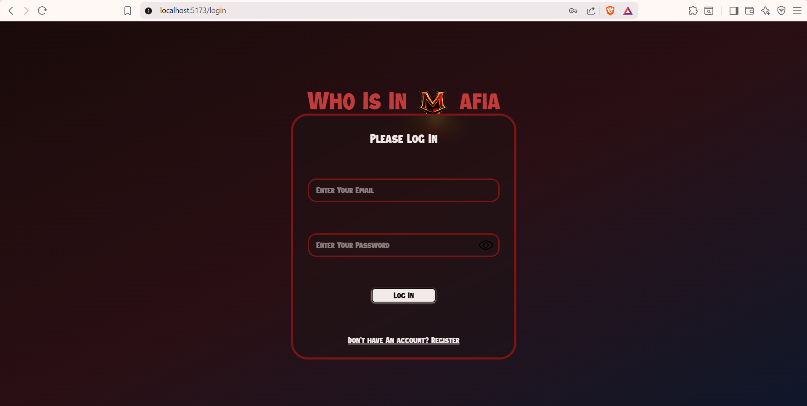
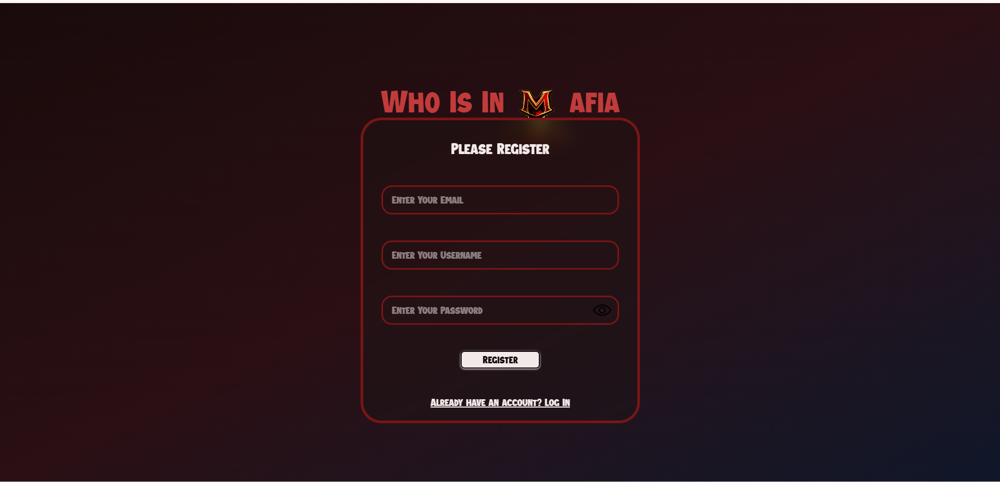
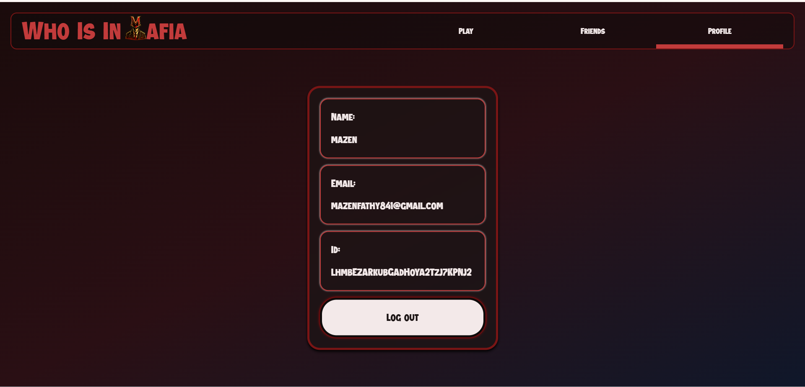
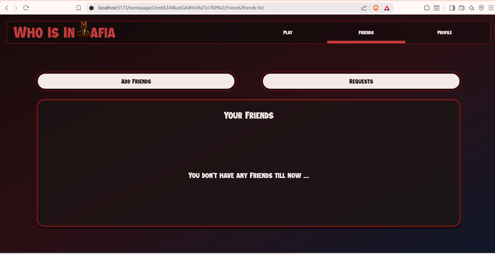
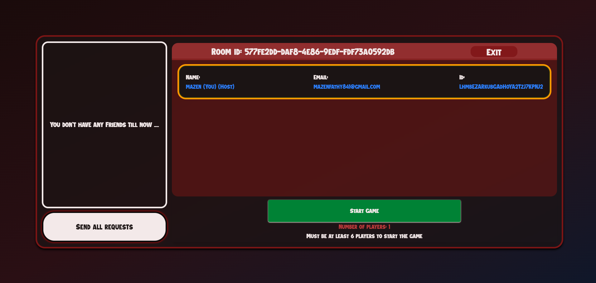

#  Who is in Mafia Web game
### By: `Mazen fathy`
### Demo: [Go now and try it](https://who-is-in-mafia.vercel.app/)
## Why I Built This Project.
Once a day, I was playing mafia game with my friends, this game is consists of many
players and one organizor, the organizor choose one mafia, one doctor, and the rest
are citizens. he decides when the mafia wake up, doctor wake up, the city sleep and
more, but we faced a problem, there isn't any one want to be the organizor;
therefore, I come with the idea of this game. I made it to be the organizer of the
game, so what is the idea of this of this game?

## The Idea of the game.

To know how this game work you must know first have a background about mafia game.
mafia game is a game played with friend, in this game the players mainly have three
roles:

- mafia
- doctor
- citizens  
  The organizor decides who to be the mafia, doctor, and the others are citizens. the
  organizor treats them as a member of city. the game
  starts when the organizor says `all the city sleep`. all the players closed there eyes
  then he says `mafia wake up`, the mafia wakes and chooses one to kill, then they goes
  back to sleep. the doctor wakes up and heals some one, he can heal themself, then
  sleeps again. then they sleeps again. the organizor wakes the city up, then he tell
  them who killed, who healed, if the killed person is the same healed person he stays
  alive or he died. Also, if the doctor died the city must know to skip doctor round.
  after discussion all vote, and the person who has most votes he is eliminated the
  game. if he was the mafia, the city wins. the game continues untill the mafia is
  eliminated or the mafia killed all the city. the game replaces the organizor in the
  game and it chooses mafia, doctor, citizens and it's responsible for game manegment
  and identifiying the current phase if it mafia turn, doctor turn, discussion, voting,
  and more.

## Tech stack

- ### React:
  Javascript libirary that facilitate state manegment compared to vanillia javascript.
- ### vite:
  it's a fast bulding tool that helped me in testing the code without building it
  many times, also it packing my project after build in dist file.
- ### Tailwindcss.
  it's a css libirary that gives the developer utility calsses which facilitate workig
  wiht css and styling.
- ### React-router-dom:
  it's a routing libirary that it used with react to build single page applications (SPA).
- ### Framer motion:
  it's a javascript animation libirary facilitate making animations espcially with react.
- ### Firebase:
  it's service provided by google to help people who dosen't have exprience in
  backend or people who are working on small projects that don't need complex
  backend, there are two main services are used in this project:
  - real-time database.
  - authentication.

## The pages of webstie

- ### Login page:
  Login page contains card with two faces:
  - login face: 
    it has two input fields one for email and the other for passowrd and log in
    button
  - registeration face: 
    it has three input fields one for email, the other for passowrd, and the last for password, and regerstiration button
    button
- ### Home page:
  This page has main three subpages and common header:
  - Profile: 
    Shows username, email and ,id.
  - Friends: 
    has friends list, requests, and add friend.
  - Play: 
    consists of notification icons that shows invetaions, and a card, the front face for creating room, the back one for joinig to room.
- ### lobby: 
  consists of two main sections invetation section and players section.
- ### Game page: 
  contains tha playing table and shows tha players and there is also end game button
  which is shown only to the host.

## Features
- creating accounts.
- Adding friedns.
- Accepting friend request.
- creating rooms. 
- joinig rooms.
- sending room invetation.
- accepting room invetation.
- the host can end the room or the game.
## Challenges
As any developer, I faced many challenges, the first one was in animating the cards 
and making them be able to be flipped, so I serched on youtube and asked Ai and after 
many tries I succed in this mission and I used this code in any other flipping card, 
Also fetching data from firebase real-time database in homepage (mainpage or main 
component) was a challenge, because I was fetching data in `Main` components which 
controles which controles subpages location,but when I strted to work on fetching 
data in friends and play subpages I relized that every paga must be resposible for 
fetching its own data to get the full control over it and to be more flexable, so I 
removed the code which from the `Main` component and adding fetching data system in 
each subpage, suitable for its purpose. One of the most biggest challenges that faced 
me was the system design of the game and how the flow must be, firstly i wasn't sure, 
how should I build it i tried without any plan and wrote code, but I failed, so I 
decided to ask for help from Ai, and he helped me in putting a plan, and we 
disscussed about how the flow of the game ,and how the system must be desined. This 
challenges is the most usefull one, because I knew what is my weakness point. 
## What I learned
This project helped me alot, he increased my react ecperince, and I knew more ES6 
helpful syntax, I prcticed react-router-dom, tailwind css, and learned framer motion 
for the time, which was one of my best choices. Also, I Knowed my weakness point, 
whihc is in designing systems, and I decided to improve it, also I knowed how making 
backend is very importatn, because firebase wasn't flexable as I want, but it worked 
well.
## What is next
After finishing this project I knew what must be next, first I must learn backend 
develpoment, then learning system design. I know that they are two big steps but I 
will breake them down into more small steps, then I will update this project to be 
more professional.

## Local Development
1. Clone the repository
git clone https://github.com/MazenFathy2008/Who-is-in-Mafia.git
cd Who-is-in-Mafia
2. Install dependencies
bash Sit up
npm install
3. Start the development server
npm run dev
4. Open your browser and visit:
http://localhost:5173
5. Build for production:
npm run build
6. Preview production:
npm run preview
### Note
This project already includes the Firebase configuration required to run the application, so there is No additional Firebase setup or environment variables are needed for local development.

## Ai usage
At the first of the project Ai was just helping me in debugging to fix the code as  
fast as possible but when the project started to have a repetitive work or there is a 
small function I used it to write it and afeter reviwing it and testing it I added it 
to the project and linked it with the rest of the project. Also he helped me in 
repetitve work like writing `PHASES` object is in 
src\components\Game\play\utils\phases.js, `GAME_FLOW` array, and `phase_data` which is
used in saving animations data. Also, I struggled in designig the system of the game 
and how should I make the game flow working, so I asked it to gave me some adviceses, 
and I modified it to be suitable for the structure of the project.